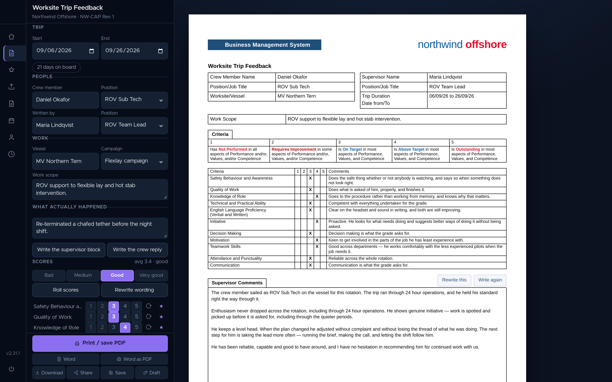
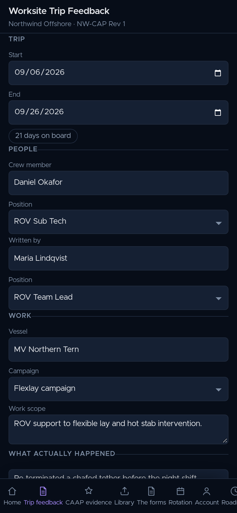
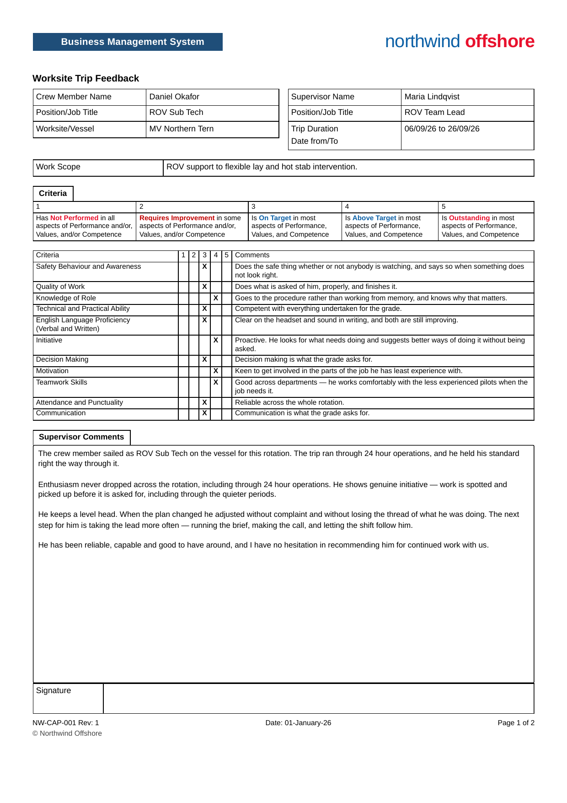
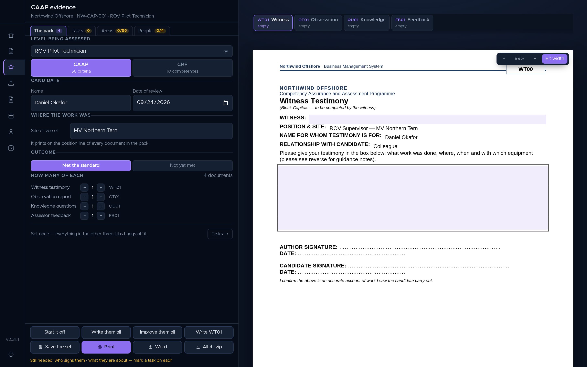

# offshore-report-app

[](https://github.com/eranoix/offshore-report-app/actions/workflows/ci.yml) [](LICENSE)  

**An app that fills in and prints the reports offshore technicians have to write, even with no internet.**

*In plain words:* People who work offshore, on oil platforms and ships, have to fill in long forms that prove they can do their job safely. Writing them by hand takes hours and the layout has to be exactly right. This app lets a technician fill in each form on screen, suggests wording based on their earlier reports, and prints a page that matches the paper original. The forms keep working on a rig or a boat with no internet connection.

A signed-in web app for filling, reviewing and printing offshore competency
paperwork, with retrieval-augmented drafting that borrows your writing voice
without borrowing anyone's facts.



## Run it

You need **Node.js 22.12 or newer** (20.19 also works) and npm. Nothing else is
needed to run the app itself.

```bash
npm install
npm run dev     # http://localhost:5173
```

The dev server is the front end only, with no API behind it, and that is
enough for the paperwork: open **Trip feedback** or **CAAP evidence** from the
side rail, type into the form and the sheet beside it fills in; **Print / save
PDF** gives the A4 page. **Rotation** works the same way. There is no sign-in
in this mode, and the parts that need a server say so instead of working:
drafting with the model, the document library, and **The forms**, the admin
page that edits the published templates.

Those run as Vercel functions (`api/`) against Supabase, and read their
settings from the environment: `AUTH_SECRET` for sessions, `SUPABASE_URL`,
`SUPABASE_ANON_KEY` and `SUPABASE_SERVICE_ROLE_KEY` for storage, `AI_UPSTREAM`
and `AI_KEY` for drafting, and `DOCX_UPSTREAM` and `DOCX_KEY` for the render
service in `vps/docx-render/`.

## Screens

<p align="center"> </p>

The same form on a phone, and the page it prints: what Chrome writes when you
press Print, not a mock-up.



CAAP evidence: the candidate, the site and the outcome are set once, and every
document in the pack (witness testimony, observation report, knowledge
questions, assessor feedback) picks them up.

---

## The part worth reading

**A prompt contract that separates style from fact.** (`api/ai.js`)

The drafting assistant retrieves passages from the signed-in user's *own*
completed paperwork and writes in their voice. That is useful and dangerous in
the same breath: a model handed someone else's report will happily reuse a
vessel name, a date or a colleague's name from it, and the result reads
perfectly while being about the wrong job.

So the retrieval has two modes, and they are written down as opposing rules:

- **Style mode:** take the cadence, the register, the level of detail from the
  passages. Take *no* fact from them: no name, no vessel, no date, no number.
- **Fact mode:** state nothing that is not in the passages.

One prompt forbids what the other requires. That is deliberate: the failure
worth preventing is a confident sentence about a job that never happened.

**Sessions verified at the edge, credentials never in the browser.**

`middleware.js` verifies an HMAC-signed session cookie using WebCrypto at the
edge, and the matcher excludes only the login page, the icons and the manifest,
so pages are unreachable without a session rather than merely hidden.

One thing gets past that gate without a session: the document server, which is
a service on another machine and has no way to hold one. It carries a ticket
instead, signed with the same secret as the session and naming one form, for
one job, for half an hour (`api/_ticket.js`). The gate takes it on `/api/render`
alone, for the two jobs in `BY_TICKET` (`doc` to fetch a form, `saved` to hand
one back), and only when the ticket names the job being asked for, so a pass to
read a form is not also a pass to replace it.

On the Node side, `api/_supabase.js` verifies with `timingSafeEqual` behind a
length pre-check, and every database call is scoped server-side by the session
subject. The browser never holds a database key, so a client cannot widen its
own scope.

**Print fidelity as arithmetic, not eyeballing.** (`src/components/Pages.jsx`)

The filled form is re-rendered to A4 with point-to-pixel conversion so what
prints matches the paper document. There is a DOCX writer
(`src/engine/docx.js`) that fills the blanks of a template rather than
generating a lookalike, and a small render service for when the browser is not
the right place to do it.

## Stack

Vite 8 + React 19, no router: the app is one workspace with panes. Vercel edge
middleware and serverless functions. Supabase over raw PostgREST. `pdfjs-dist`
for reading, `fflate` for writing DOCX. Installable as a PWA, and it works from
a single file offline, because offshore is where it is used.

## Languages

| Language | Size | Where | What it does there |
| --- | --- | --- | --- |
| JavaScript | 1,184,277 B · 88.1% | `src/`, `api/`, `middleware.js`, `scripts/`, `vps/` | The app itself (React 19, 21 `.jsx` files), the edge and serverless code, the small render service, and 41 `.mjs` checks, benches and helpers in `scripts/`: undeclared-name analysis, model-output checks, and ten that drive a real browser. `published.js` is a dump of the published forms, and is not counted. |
| CSS | 142,760 B · 10.6% | `src/styles/app.css`, `src/styles/shell.css` | Written by hand: no framework, no preprocessor. `form.css` is generated from the printed form's own markup, and is not counted. |
| HTML | 10,819 B · 0.8% | `index.html`, `public/login.html` | The Vite entry, and a sign-in page that stands alone with its styles inline, so it waits on nothing from the network. |
| Python | 6,387 B · 0.5% | `worker/ocr.py` | Reads the library's scans on the server with `pdftoppm` and `tesseract`, and writes the text and its passages back for retrieval. |
| Shell | 399 B · 0.03% | `worker/run-ocr.sh` | Checks the service key is in the environment and execs the worker beside it. |

The two `.gitattributes` rules here mark the two files nobody wrote, `form.css`
and `src/forms/published.js`, both generated, so neither counts as a language
someone chose. Nothing else needs correcting: no dependency is committed and
nothing is vendored, so GitHub's own count is the honest one.

## Tests

```bash
npm test
```

The full suite needs more than Node. Install these first and make sure they are
on the `PATH`:

- **Google Chrome** (`google-chrome`), for the checks that open the built site.
- **LibreOffice** (`soffice`), which lays each `.docx` out the way it will print.
- **poppler** (`pdftotext`, `pdftoppm`), which reads the laid-out pages back.

`npm test` starts the render service from `vps/docx-render/` on
`127.0.0.1:8791` with a throwaway key for as long as the run lasts. If that port
is taken, pick another with `DOCX_PORT=8792 npm test`. If you already run the
service, set `DOCX_KEY` to its key (and `DOCX_PORT` to its port) and the suite
uses yours instead. The run builds the site as one of its steps and takes a few
minutes, most of it LibreOffice laying pages out.

Sixteen checks, with the build in the middle of them. Three drive headless
Chrome over CDP (`ws` against `--headless=new`, no driver library) and open the
built site: every page, the library's viewer, the pack panel. Six read the
output instead of the screen: every field of every form inside the `.docx` that
comes out, where the blanks sit, the writing box measured on the page that was
actually drawn, a form's wording changed in its runs, the days-at-sea workbook
refusing a renamed sheet, a changed heading or a formula typed over, and names a
module uses but never declares. Four are about the writing: the verdict parsed
out of an answer, the statement that talks about itself, the trip feedback that
drifts off the man and onto the job, and one full minute of upstream limit
discovered once instead of six times. Three hold the calendar to arithmetic:
the rotation across clock changes, the calendar account the way an iPhone talks
to it, and the half-day rule checked against a spreadsheet's own sums.

They test what comes out, which is the thing that has to be right.

## Scripts that call a live service

The rest of `scripts/` are maintenance tools and checks against a running
deployment: the model readings (`areas`, `grounded`, `orphans`, `proves`,
`tasks`, `voice`, `behaviour --live`), the checks that sign in to a deployed
site (`live`, `live-update`, `forms`, `fits`, `printed`, `word`, `publish`), and
the jobs that write to its store (`seed-templates`, `forms-pull`, `reindex`).
None of them is part of `npm test`. They read everything from the environment,
and one that needs a variable it does not have stops and names it.

| Variable | Read by | What it is |
| --- | --- | --- |
| `AI_KEY` | the model readings, `tasks` | Key for the model upstream. `AI_UPSTREAM` and `AI_MODEL` move the address and the model. |
| `DOCX_KEY` | `publish`, and the render checks in `npm test` | Key of the render service in `vps/docx-render/`; `DOCX_PORT` is its port. `npm test` starts its own and sets both. |
| `SUPABASE_URL`, `SUPABASE_SERVICE_ROLE_KEY` | `seed-templates`, `forms-pull`, `publish`, `tasks`, `worker/run-ocr.sh` | The Supabase project and its service role key. |
| `OFFSHORE_REPORT_URL` | the checks that sign in | Address of the deployed site (`forms`, `live-update` and `publish` read it as `OFFSHORE_REPORT_SITE`). |
| `OFFSHORE_REPORT_EMAIL`, `OFFSHORE_REPORT_PASSWORD` | the checks that sign in | A test account on that site. |
| `LIBRARY_DIR` | `reindex` | The library bucket's directory on the storage disk (not needed with `--fast`). |

## Note on the forms

This is a public copy. The blank forms it ships (`src/forms/`) and the
competency framework (`src/engine/caap.json`) are original, written for this
repository. The application was built around a real operator's paperwork, which
is that operator's copyright and does not travel with it. The terminology in
`src/engine/vocab.json` comes from published industry standards (IMCA C005,
API RP 17H and IMCA metrology guidance) and is cited as such in the file.
